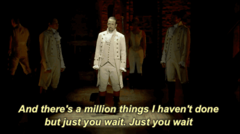

# The Don't Fret Guitar Pedal Recommender

A guitar pedal recommender to help make buying new pedals easier.

Based on the answers to a few questions that aim to get a sense of a guitarist's style, Don't Fret returns to them a list of the most likely guitar pedals to work for them.

Please read on for a more detailed look at the motivation and process behind this project.

## Thank You

A quick thank you to Galvanize instructors and my fellow classmates for all of their help on this project. It was completed in two weeks as my capstone and I could not have done it without them. Also thanks to anyone who is reading this and checking out my project.

## The Problem

Guitar pedals are one of the many tools guitarists can use to adjust the sound of the music they play.
For guitarists looking to dive deeper into the realm of pedals, it can be a daunting task to decide which to purchase. There are various categories (distortion, delay, tuner, etc.) that each have hundreds of pedals to choose from. A great deal of these pedals can also fit specific genres and/or playing styles. As such, a great deal of research can go into purchasing just one pedal. This recommender attempts to narrow down the search and help guitarists make the decision of what pedals to purchase.

## The Data

The data was scraped from Equipboard.com, a website where contributors can update professional musician's pages to add in all of the equipment they have used. This data includes: artist names, genres, bands they are a member of, similar artists, and all of their equipment including guitar pedals. Ideally for a recommender system it is best to have explicit ratings (a 0-5 to describe how well you enjoyed something for instance) however for this project I needed to use implicit ratings. Therefore, if a professional had a pedal the rating was a 1 and if they did not it was a 0.

## The Model

First, I used Spark's ALS implicit model trained on the professionals and all of the pedals that they own with either a 0 or 1 rating. Then, in order to solve the cold start problem for a new user, I used scikit-learn's cosine similarity to find the closest professionals based upon the new user's preferred genre, artist influences, and existing pedals.

### Quick note on Spark's ALS

The specific model used was Spark's ALS.trainImplicit. This model's returned "rating" is not a prediction on whether or not the user will have or not have the pedal but rather how certain the model is that the user will have the pedal. Therefore the rating was used to rank the recommendations and capture the top n number of pedals and not to actually predict.

## The Final Output

I created a web app that would allow guitarists to enter their genres, artist influences, and existing pedals then view a table of all of the recommended guitar pedals. However, musicians are tricky creatures so ideally these recommendations can be used as a starting point. I would hope that minimally this recommender will remove a great deal of the pedals that would definitely not work for a guitarist's style.

## Future work

First, I want to have the app up and running on my website. Then ideally, I would want to include other equipment and musicians in this project. So that a guitarist can also narrow down the search for their guitars or amplifiers. Hopefully at one point bassists, drummers, and keyboardists can also use Don't Fret.

I also want to add more features to the results of the web app including: average price, link to purchase, link to a youtube review, perhaps even an audio clip if available, and specifically which professionals have used the equipment. Essentially, I would want this to be the first stop when an artist decides to make a new equipment purchase.

### Further Evaluation

I want to perform more evaluation of the model. After I have the site up and running I would like to receive feedback from individuals who use it to see how relevant the recommendations actually are.

## Again, Thank You!

If you have read this entire page, thank you! I hope you enjoyed reading and/or learned something from my project.

Now go listen to or play some music!

<table border="0"; align="center">
<tr>
<td></td>
<td></td>
<td></td>
<td></td>
</tr>
<tr>
<td></td>
<td></td>
<td></td>
<td></td>
</tr>
</table>
<!-- 
 
 
 
 -->

